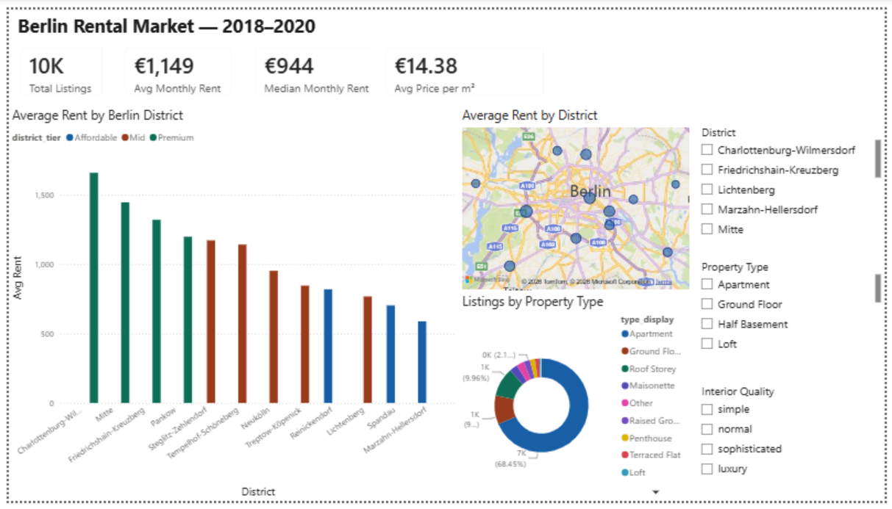
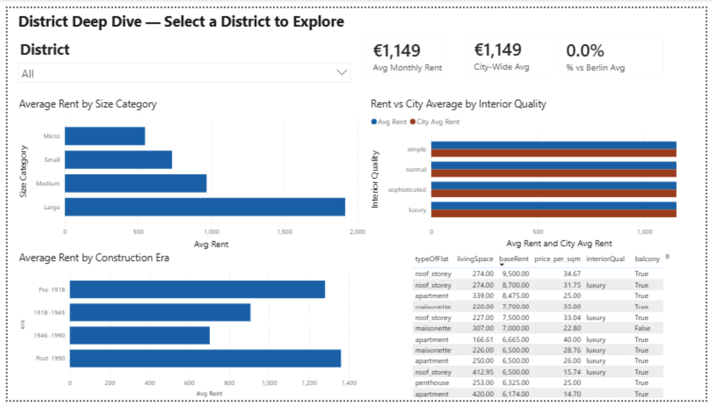
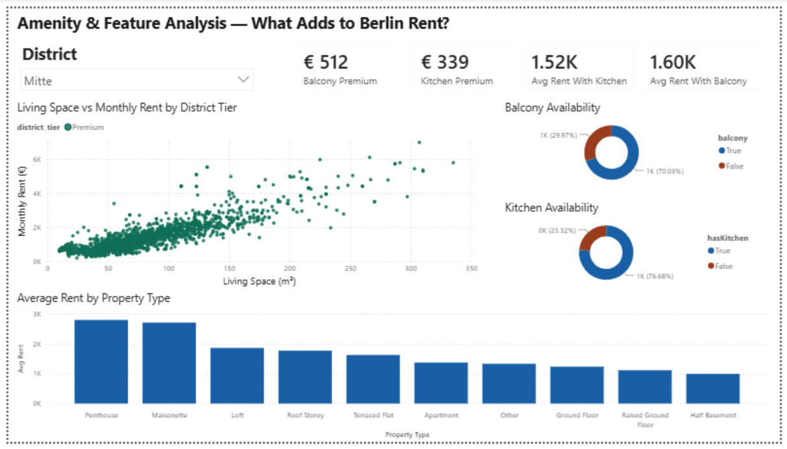

# Berlin Rental Market Analyzer

| Market Overview | District Deep Dive | Amenity Analysis |
|---|---|---|
|  |  |  |


---

## What This Project Is

Berlin's rental market is one of the most closely watched in Europe — rising prices,
stark district inequalities, and persistent housing shortages make it a rich subject
for data analysis. This project analyses **10,369 real listings** from ImmobilienScout24
to answer: where is rent highest, what drives price, and which amenities carry a
measurable premium?

The project covers the complete analytics pipeline — data acquisition, cleaning,
SQL-based analysis, Python visualisations, and an interactive Power BI dashboard.
It was built as a portfolio piece targeting data analyst roles in the German job market,
with deliberate focus on SQL and Power BI as core technical deliverables.

---

## Key Findings

- **Average rent is €1,149/month** (median €944) — the gap between mean and median
  reveals a long tail of premium listings pulling the average upward
- **Charlottenburg-Wilmersdorf is the most expensive district** (~€1,670/month average),
  while **Marzahn-Hellersdorf is the most affordable** (~€600/month) — a nearly 3× gap
  across the city
- **A fitted kitchen adds ~€454/month** to average rent; a balcony adds ~€330/month —
  amenities carry a significant and measurable premium in Berlin
- **Pre-1918 Altbau apartments command a price premium** over post-1990 construction,
  reflecting ongoing demand for Berlin's historic period buildings
- **Average price per m² is €14.38** across Berlin, with penthouse listings at the top
  and half-basement units at the bottom of the property type range

---

## Tech Stack

| Layer | Tools |
|---|---|
| Data wrangling | Python 3.11.5, Pandas, NumPy |
| Database | SQLite 3, SQLAlchemy |
| Visualisation | Matplotlib, Seaborn |
| BI Dashboard | Power BI Desktop, DAX, Power Query |
| Version control | Git, GitHub |

---

## Power BI Dashboard

The dashboard is a 3-page interactive report built on a star schema data model
with 20+ DAX measures.

**Page 1 — Market Overview:** KPI cards (total listings, avg rent, median rent,
avg price per m²), average rent by district coloured by district tier, Berlin map
with rent bubbles, listings by property type, and slicers for district, property type,
and interior quality.

**Page 2 — District Deep Dive:** Avg rent vs city-wide average KPI cards,
rent by size category (Micro → Large), rent by construction era (Pre-1918 → Post-1990),
rent vs city average by interior quality, and an individual listings detail table.

**Page 3 — Amenity Analysis:** Balcony and kitchen premium KPI cards, living space
vs rent scatter plot coloured by district tier, balcony and kitchen availability
donuts, and average rent by property type.

The `.pbix` file is in `powerbi/` and a PDF export is in `reports/`.

---

## Project Structure

```
berlin-rental-market-analyzer/
│
├── data/
│   ├── raw/            # Original dataset — never modified (gitignored, > 50 MB)
│   └── clean/          # Cleaned CSV (berlin_listings_clean.csv) + SQL query outputs (q01–q10)
│
├── src/                # Python scripts — one script per pipeline stage
│   ├── download_data.py        # Downloads dataset from Kaggle
│   ├── clean_data.py           # Cleaning pipeline and feature engineering
│   ├── data_quality_check.py   # Data quality report (nulls, dtypes, row counts)
│   ├── load_to_sqlite.py       # Loads clean data into SQLite database
│   ├── run_all_queries.py      # Runs all SQL queries and exports CSVs
│   └── visualizations.py       # Generates all Matplotlib/Seaborn figures
│
├── sql/                # All .sql query files (10 analytical queries + schema)
│
├── reports/
│   ├── figures/        # Chart PNGs (300 dpi) + dashboard screenshots
│   └── Berlin_Rental_Dashboard.pdf
│
├── powerbi/
│   └── berlin_rental.pbix
│
├── .gitignore
├── requirements.txt
└── README.md
```

---

## How to Run

```bash
# 1. Clone the repo and enter the project folder
git clone https://github.com/Bas-sel/berlin-rental-market-analyzer.git
cd berlin-rental-market-analyzer

# 2. Create and activate the conda environment, then install dependencies
conda create -n berlin_rental python=3.11.5 && conda activate berlin_rental && pip install -r requirements.txt

# 3. Download the raw data (requires a Kaggle API token at ~/.kaggle/kaggle.json)
python src/download_data.py
```

Then run the pipeline scripts in order:

```bash
python src/clean_data.py
python src/load_to_sqlite.py
python src/run_all_queries.py
python src/visualizations.py
```

> The raw dataset is not committed to this repo (CC BY-NC-SA 4.0 licence, non-commercial use).
> You will need a [Kaggle API token](https://www.kaggle.com/docs/api) to download it.

---

## Methodology

1. **Data acquisition** — Downloaded from Kaggle via API; Germany-wide dataset (268,850 rows)
   filtered to Berlin listings only
2. **Cleaning** — Outlier removal (rent 100–10,000 EUR, floor area 10–500 m²),
   deduplication by `scoutId` keeping the most recent snapshot per listing,
   Bezirk name standardisation to the 12 official Berlin districts
3. **Feature engineering** — `price_per_sqm`, `size_category` (Micro / Small / Medium / Large),
   `era` (Pre-1918 / 1918–1945 / 1946–1990 / Post-1990), `district_tier` (Affordable / Mid / Premium)
4. **SQL analysis** — 10 analytical queries including window functions (RANK, LAG),
   CTEs, correlated subqueries, and multi-level aggregations in SQLite
5. **Python visualisations** — 10 Matplotlib/Seaborn charts covering distribution,
   correlation, and geographic comparisons, saved at 300 dpi
6. **Power BI dashboard** — Star schema data model (1 fact table + 5 dimension tables),
   20+ DAX measures, 3-page interactive dashboard with slicers and map visuals

---

## Phases

| Phase | Description | Status |
|---|---|---|
| 0 | Setup & Foundation | ✅ Complete |
| 1 | Data Acquisition | ✅ Complete |
| 2 | Data Cleaning & EDA | ✅ Complete |
| 3 | SQLite Database & SQL Analysis | ✅ Complete |
| 4 | Python Visualisations | ✅ Complete |
| 5 | Power BI Dashboard | ✅ Complete |
| 6 | Polish, Documentation & Launch | ✅ Complete |

---

## Data Source

**Dataset:** [Apartment Rental Offers in Germany](https://www.kaggle.com/datasets/corrieaar/apartment-rental-offers-in-germany)  
**Source:** ImmobilienScout24 scrapes via Kaggle (corrieaar)  
**Coverage:** Germany-wide, four scrape dates: Sep 2018 – Feb 2020  
**Berlin subset:** 10,369 listings after filtering and cleaning  
**Licence:** CC BY-NC-SA 4.0 — non-commercial use  

---

## Licence

This project is licensed under the MIT Licence.

---

*Built by Bassel Kurbaj · [linkedin.com/in/baselku](https://www.linkedin.com/in/baselku)*
